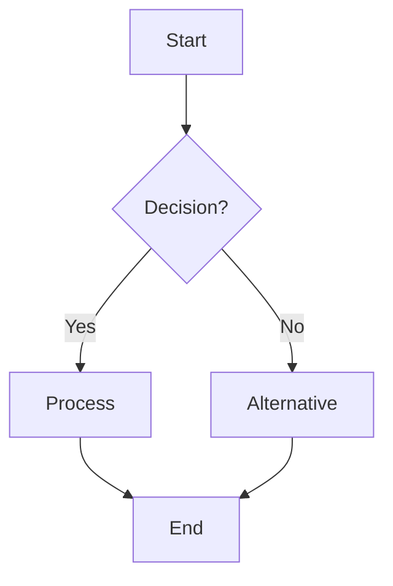

# Da Vinci Mermaid Workflow

**Hand-drawn flowcharts and sequence diagrams using Mermaid rendered in Leonardo notebook aesthetic.**

Creates **FLOWCHARTS, SEQUENCE DIAGRAMS, STATE MACHINES** — Da Vinci sketch style applied to structured diagrams.

---

## Purpose

Mermaid diagrams for:
- Flowcharts with decision paths
- Sequence diagrams showing interactions
- State machines with transitions
- Entity relationship diagrams
- Git graphs

---

## Approach Options

### Option A: Pure Hand-Drawn (Recommended)

Generate the flowchart as a hand-drawn Da Vinci illustration without using Mermaid syntax.

### Option B: Mermaid + Style Overlay

1. Create Mermaid code for structure
2. Generate hand-drawn version matching the structure

---

## 🚨 WORKFLOW STEPS

### Step 1: Extract Logic Structure

Map the flowchart:
```
START → [Step A]
         ↓
     <Decision?>
      ↙      ↘
  [Yes]      [No]
     ↓         ↓
  [Step B]  [Step C]
         ↘  ↙
         END
```

---

### Step 2: Plan Visual Layout

- **Flow direction:** Top-to-bottom or left-to-right
- **Decision diamonds:** Hand-drawn irregular diamonds
- **Process boxes:** Sketchy rectangles
- **Arrows:** Imperfect, variable weight

---

### Step 3: Construct Prompt

```
Hand-drawn flowchart in Leonardo da Vinci notebook style
on warm parchment background (#ECE6D9).

DIAGRAM TYPE: [Flowchart / Sequence / State Machine]

STRUCTURE:
[Describe the flow in words, e.g.:]
"Start at top with 'Input' box. Arrow down to diamond 'Valid?'.
Yes branch goes left to 'Process' box. No branch goes right to 'Error' box.
Both converge to 'Output' at bottom."

NODES:
- Start/End: Rounded rectangles, hand-drawn
- Process: Sketchy rectangles with labels
- Decision: Hand-drawn diamonds (imperfect angles)
- All in deep slate blue (#3B546B)

ARROWS:
- Hand-drawn with slight wobble
- Variable line weight
- Measurement ticks on longer arrows
- Muted steel gray (#7A8C9B) for secondary paths

LABELS:
- Hand-lettered Montserrat style
- Inside nodes or as annotations
- Clear and readable

CONSTRUCTION GEOMETRY:
- Faint guide lines showing alignment
- Ghost circles at connection points
- Proportion marks for spacing

ACCENT:
- Burnt copper (#CF5828) on key decision point
- Use sparingly — one element only

CRITICAL:
- NOT perfect vectors — hand-drawn wobble
- Visible construction lines
- Cross-hatching for any emphasis
- Leonardo notebook aesthetic
```

---

### Step 4: Execute Generation

```bash
bun run ~/.claude/Skills/Art/tools/generate-ulart-image.ts \
  --model nano-banana-pro \
  --prompt "[YOUR PROMPT]" \
  --size 2K \
  --aspect-ratio 1:1 \
  --output /path/to/flowchart.png
```

**Aspect ratios:**
- Vertical flow: 9:16
- Horizontal flow: 16:9
- Balanced: 1:1

---

### Step 5: Validation

**Must Have:**
- [ ] Clear flow direction
- [ ] Readable labels
- [ ] Hand-drawn imperfect shapes
- [ ] Construction geometry visible
- [ ] Parchment background
- [ ] Logical structure preserved

**Must NOT Have:**
- [ ] Perfect geometric shapes
- [ ] Clean vector lines
- [ ] Confusing flow direction
- [ ] Illegible text

---

## Mermaid Reference (If Generating Code)



Then describe this structure in the hand-drawn prompt.
