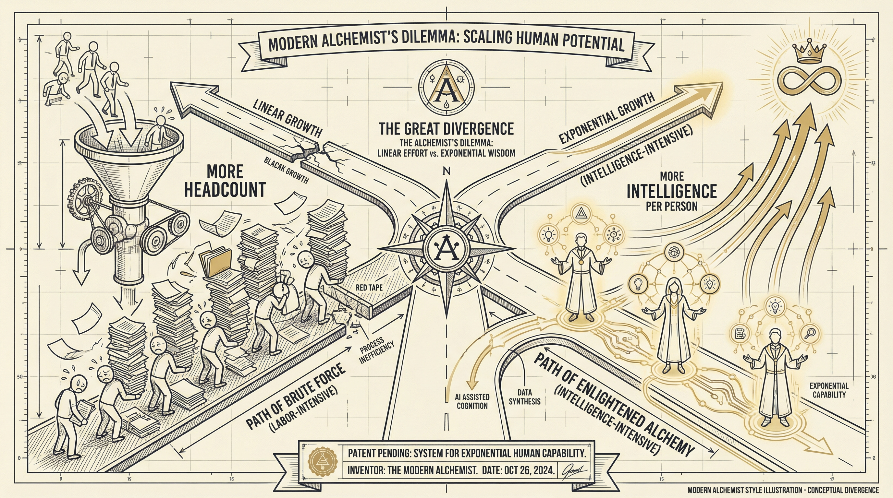
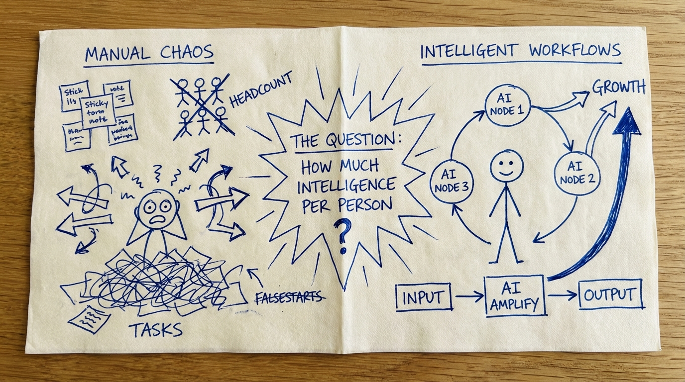
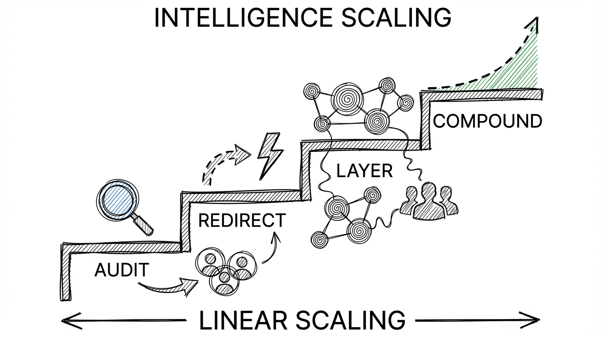
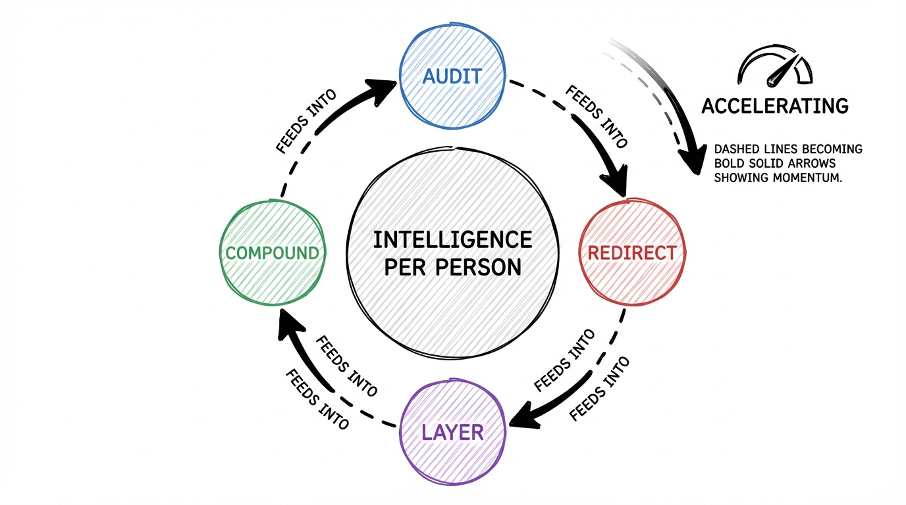
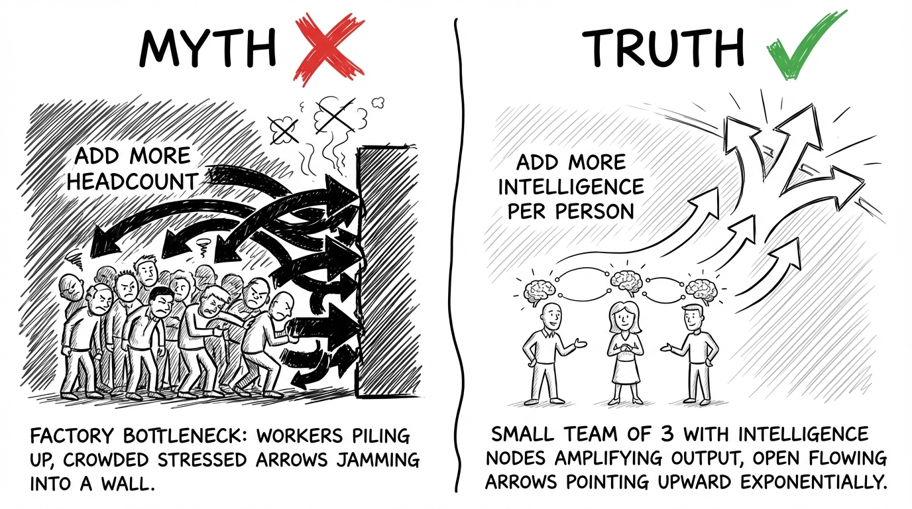

# Your Competitor Stopped Hiring. They Started Winning.

**Eyebrow:** The 30-Point Gap Between AI Adopters and Everyone Else

**Deck Copy:** One logistics company cut inventory costs 30%, improved on-time delivery 25%, and increased retention 15% -- without adding a single person. The strategy is not a secret. It is just uncomfortable.

---

## The Headcount Trap

Your CFO is accidentally right.

Everyone says "do more with less" is a budget excuse. A corporate mantra designed to squeeze blood from a stone. That is exactly why most operations teams stay on the treadmill -- running faster, hiring more, and watching margins shrink anyway.

This is for operations leaders who want to scale output without scaling headcount but feel trapped between a CFO who says no and a team that is already drowning.

If you have ever struggled with:

- Headcount requests denied while workload doubles
- Your best people burning out on data entry, report formatting, and copy-paste workflows
- Watching competitors announce results you cannot match no matter how many hours your team works

You are in the right place.

Because what if you could:

-> Handle 55% more work with the same team
-> Redirect the salary of one unfilled position into intelligence that multiplies everyone's output
-> Show your board measurable results in 30 to 90 days instead of 18-month transformation timelines
-> Turn "do more with less" from a punishment into a strategy that makes you look like a genius

Here is how.

---

## How I Watched $2.4 Million Walk Out the Door

**Where I Started:**

I spent years inside enterprise technology implementations. ERP rollouts. CRM deployments. Process redesigns that looked beautiful on a PowerPoint slide and crumbled in production. I saw the pattern from the inside: companies would throw bodies at operational problems because that is what the playbook said. More people equals more capacity. Simple math.

Except the math was wrong.

**The Struggle:**

One mid-market distribution company sticks in my memory. Forty million in revenue. Growing fast. The VP of Operations came to leadership with the same request three quarters in a row: five more analysts to handle order processing, inventory reconciliation, and customer reporting.

Three times, the CFO said no.

I watched that VP do what most operations leaders do. He absorbed the work himself. His team started pulling 55-hour weeks. Then 60. Their best inventory analyst quit. A major customer complained about shipping accuracy. The VP started updating his resume.

That company was bleeding $2.4 million a year in operational inefficiency. Not because the team was bad. Because the team was doing work that should never have required human hands.

They were copying data from emails into spreadsheets. Reformatting reports for three different stakeholders. Manually reconciling inventory across two systems that should have talked to each other. Smart, talented people doing the operational equivalent of carrying water in buckets when a pipe was available.

**The Turning Point:**

The shift happened when we stopped asking "How many people do we need?" and started asking "How much intelligence does each person need?"

That single question changed the trajectory.

**The Solution:**

Instead of hiring five analysts at $75,000 each, the company redirected one unfilled position's salary into an intelligence layer. Automated data flows between systems. Predictive alerts for inventory exceptions. Auto-generated reports that used to take two days of manual assembly.

**The Results:**

Within 90 days, the same team handled 40% more order volume. Error rates dropped by half. The VP who was updating his resume got promoted to Chief Operating Officer the following year.

The lesson? You do not need more people. You need more intelligence per person. And the gap between companies that understand this and companies that do not is accelerating every quarter.

---

## The Intelligence-Per-Person Framework

Here is the truth: the companies pulling ahead are not spending more. They are spending differently. They redirected the headcount budget they were never going to get into intelligence that multiplies what their existing team can do.

It works in four steps.

### Step 1: Audit the Repetition Tax -> Know Where Your Team Bleeds Hours

Before you change anything, you need to see the real cost of manual work.

Every operations team carries what I call the Repetition Tax -- the hours burned each week on tasks that follow a predictable pattern. Data entry. Report assembly. Cross-system reconciliation. Status updates that require pulling numbers from four different tools.

Most leaders underestimate this tax by 40 to 60%. When you actually track where hours go, the number is staggering.

Skip this step and you will automate the wrong things. You will spend money on shiny tools that sit unused because they solved a problem nobody had.

**Example:** A 150-employee e-commerce company did this audit and found their engineering team spent 35% of its time on deployment processes and manual testing. Not building. Not improving. Deploying and testing. That single insight redirected their entire automation strategy.

### Step 2: Redirect the Headcount Budget -> Turn Denied Positions Into Intelligence Investment

This is where the CFO becomes your ally instead of your obstacle.

Take the salary of one unfilled position -- the one you are not getting approved -- and propose redirecting it into workflow intelligence. You are not asking for new money. You are reallocating money that was already earmarked but going nowhere.

A single $75,000 salary funds a meaningful intelligence layer. Automated data flows. Predictive exception handling. Self-generating reports. AI-assisted decision support.

The conversation with finance shifts from "I need more people" to "I can deliver more output at the same cost." No CFO argues against that.

**Example:** A logistics company redirected the budget of two unfilled positions into automated supply chain management. The result: 30% reduction in inventory holding costs, 25% improvement in on-time deliveries, and 15% increase in customer retention. The headcount they did not hire became the margin they kept.

### Step 3: Layer Intelligence Onto Existing Operations -> Amplify People, Don't Replace Them

This is not about ripping out your current systems. It is about adding an intelligence layer on top of what you already have.

Think about it like electricity. When electricity became cheap and reliable, the companies that won were not the ones building power plants. They were the ones building appliances -- products that created new value using commodity power. Your ERP, your CRM, your spreadsheets -- that is your infrastructure. The intelligence layer is the appliance that makes it useful.

Workflow automation. AI-powered exception detection. Predictive analytics embedded in operational dashboards. Decision support that turns raw data into recommended actions.

Your people stop being data processors and start being decision makers. Same team. Dramatically higher output.

**Example:** Acme Manufacturing, a midsize aerospace and automotive component manufacturer, layered AI-powered production scheduling onto their existing manufacturing systems. The intelligence layer eliminated the manual scheduling work that used to consume entire analyst days, letting the team focus on optimizing production flow instead of managing it.

### Step 4: Compound the Advantage -> Use Early Wins to Fund the Next Layer

Here is where the gap between adopters and everyone else becomes permanent.

The first intelligence layer generates savings and capacity. You take those results -- measurable, documented, real -- back to leadership. Now you are not asking for budget. You are showing ROI and requesting expansion.

Each layer compounds. Your team gets more capable. Your operations get more intelligent. Your margins improve because revenue grows without proportional cost.

The competitor who is still hiring linearly cannot catch you. They are adding people while you are adding intelligence per person.

**Example:** The mid-market e-commerce company that started with deployment automation eventually saved $600,000 annually and increased deployment frequency 15x. Each win funded the next layer. Within two years, they operated at a scale that would have required triple the headcount under the old model.

---

## The Research Backs This Up

**Study 1: McKinsey -- The State of AI (2025)**

McKinsey found that redesign of workflows -- not technology deployment -- has the biggest effect on whether organizations see EBIT impact from AI. Companies that focused on how work gets done rather than which tools to buy captured disproportionate value. Early adopter companies now handle 55% more work compared to only 25% for laggards. That 30-point gap is not closing. It is accelerating. And only 6% of organizations have achieved 5% or greater EBIT impact from AI -- meaning the window to gain competitive advantage is still wide open for those willing to move.

**Study 2: Bain & Company -- Automation Scorecard**

Bain found that automation leaders -- companies investing at least 20% of their IT budget in intelligent automation -- reduced costs by 17% on the processes they addressed. More revealing: firms deploying complex, intelligence-driven automation achieved 18% cost savings, double the impact of simple process automation. The lesson is clear. Basic automation is table stakes. Intelligence-layered automation is where the margin advantage lives.

---

## Real-World Applications

### Example 1: Netflix -- Building a Billion-Dollar Engine on Commodity Infrastructure

**Situation:** Netflix needed to scale streaming from a small DVD-by-mail business to a global content platform serving hundreds of millions of users.

**Action:** Instead of building their own data centers, they completed a full migration to AWS -- commodity cloud infrastructure. Then they poured resources into what mattered: recommendation algorithms, content delivery optimization, and user experience intelligence. They built proprietary value at the intelligence layer while treating infrastructure as a utility.

**Result:** Between 2007 and 2015, content streaming hours increased 1,000x. Netflix became a $150 billion company not by owning infrastructure but by owning the intelligence layer on top of it.

**Lesson:** The competitive moat is never in the pipes. It is in what flows through them. Netflix used commodity infrastructure and built intelligence that competitors could not copy.

### Example 2: A Logistics Company That Stopped Hiring and Started Winning

**Before:** A mid-sized logistics company relied on manual supply chain management. Inventory errors were routine. On-time delivery was inconsistent. Customer churn was climbing. The operations team kept asking for more analysts.

**What Changed:** They implemented an intelligence layer -- automated supply chain management with predictive analytics and intelligent workflow automation. Same infrastructure. Same team. New intelligence.

**After:** 30% reduction in inventory holding costs. 25% improvement in on-time deliveries. 15% increase in customer retention. Zero new hires.

**Key Insight:** The intelligence layer did not replace people. It replaced the repetitive, error-prone work that was burying people. The team went from data entry operators to strategic logistics managers. Same headcount. Completely different output.

### Example 3: When I Applied This to Content Operations

**The Challenge:** My own content production process required 15 to 20 hours per cornerstone article. Research, synthesis, drafting, editing, extraction into multiple platforms. The work was good but the pace was unsustainable.

**What I Did:** Applied the Intelligence-Per-Person Framework to my own workflow. Audited where the hours went (Step 1). Redirected tool budget from three underused SaaS subscriptions into AI-powered research and drafting assistance (Step 2). Layered intelligence into each phase of the content pipeline (Step 3). Used the time savings to produce more content, which generated data on what worked, which improved the next cycle (Step 4).

**What Happened:** Same quality. Three times the output. The repetitive parts -- research compilation, formatting, platform adaptation -- were handled by the intelligence layer. I focused on what required human judgment: voice, strategy, insight.

**What I Learned:** The framework scales down to a team of one and up to teams of hundreds. The principle is identical: find the Repetition Tax, redirect resources to intelligence, and compound the advantage.

### Example 4: The Morning Report That Nobody Needed to Build

**Common Situation:** Every Monday, a department manager spends two hours pulling numbers from three different systems, pasting them into a spreadsheet, formatting a report, and emailing it to leadership. The same report. Every week. For years.

**Wrong Approach:** Hire a junior analyst to do it. Now you have a $55,000 salary committed to a task that adds zero strategic value. The analyst gets bored. The report still takes an hour because now it requires review and corrections.

**Right Approach:** Layer intelligence onto the existing systems. Auto-pull the data. Auto-format the report. Auto-distribute it Sunday night. Total cost: a fraction of that analyst's salary. The manager gets Monday morning back for strategic work. The analyst you did not hire is the margin you kept.

**Why It Works:** The Intelligence-Per-Person Framework targets exactly this kind of Repetition Tax -- predictable, pattern-based work that follows rules humans should not be spending their cognition on.

### Example 5: What NOT to Do -- The Enterprise That Built When It Should Have Bought

**The Mistake:** A $60 million manufacturing company decided to build a custom AI-powered scheduling system from scratch. Six developers. Eighteen-month timeline. $1.2 million budget. They believed owning the infrastructure and code would create a competitive advantage.

**Why It Failed:** At month twelve, they had a prototype that handled 40% of their scheduling scenarios. The remaining 60% required edge-case logic that kept expanding scope. At month eighteen, they had spent the full budget and were six months from a usable product. Meanwhile, a competitor purchased a vertical AI scheduling solution for $80,000 per year and was operational in six weeks.

The custom build became a sunk-cost trap. They spent $1.2 million to build infrastructure when the infrastructure was already a commodity. The intelligence -- the scheduling optimization -- was available off the shelf.

**Better Alternative:** Buy commodity infrastructure and intelligence applications. Build only where you have genuine differentiation. In 2024, 47% of AI solutions were built internally. By 2025, 76% are purchased. The market has spoken: the Repetition Tax of building infrastructure you could buy is one of the most expensive mistakes a mid-market company can make.

---

## What Most People Get Wrong

**The Myth:**

Most people think scaling operations requires proportional headcount growth. Twice the revenue means twice the team. Three new product lines mean three new departments.

**Why They Believe It:**

Because it worked for fifty years. The industrial model was built on this math. More output required more hands. Every MBA program taught it. Every operations playbook assumed it. And when you are underwater with work, the instinct is visceral -- "I need help" means "I need another person."

**The Hidden Cost:**

This belief leads to:

- Margin compression that worsens with every hire (revenue grows linearly, overhead grows linearly, profit gets squeezed in between)
- Best employees burned out doing work that should not require human hands (they did not get a master's degree to copy-paste data from email to spreadsheet)
- A permanent speed disadvantage against competitors who invest in intelligence per person instead of headcount per function

**The Truth:**

The directive "do more with less" is correct. The method is wrong.

The problem was never that you need fewer people. The problem is you need more intelligence per person. AI capabilities reduce manual effort by 60 to 70%. Early adopters handle 55% more work. The gap is real and it is compounding.

Here is what they are missing: headcount scaling is linear. Intelligence scaling is exponential. Every person you add creates a fixed increase in capacity. Every intelligence layer you add multiplies the capacity of everyone already on the team.

**The Real Problem:**

It is not a budget problem. It is a model problem. The mental model of "more work requires more people" is the trap. When you shift from "I need headcount" to "I need intelligence per person," the constraint dissolves. The CFO becomes your partner. The team becomes more capable instead of more exhausted.

**What Becomes Possible:**

Same team. Dramatically higher output. Your best people doing strategic, creative, judgment-intensive work instead of copy-paste operations. Margins that improve as you grow because revenue scales while cost stays flat. And a competitive position that compounds every quarter because your competitor is still hiring linearly while you are scaling through intelligence.

---

## How to Implement This (Starting Today)

### Your 4-Week Implementation Plan

**Week 1: Audit the Repetition Tax**

Action: Have every team member track their time for five days. Categorize each task as "requires human judgment" or "follows a predictable pattern." Calculate the total hours per week spent on pattern-based work.

Goal: A clear, documented picture of where your team's hours go. Most leaders find 30 to 50% of total hours are pattern-based. That is your Repetition Tax number.

**Week 2: Identify the Highest-Value Redirect**

Action: Take your Repetition Tax list and rank the pattern-based tasks by two factors: hours consumed and business impact of errors. The sweet spot is the task that burns the most hours AND causes the most problems when done wrong.

Goal: One specific process identified as your first intelligence target. Not five. Not ten. One.

**Week 3: Build the Business Case**

Action: Calculate the cost of your target process (hours multiplied by average hourly rate, plus error cost). Research purchased AI solutions for that specific workflow. Present a one-page comparison: "Cost of doing nothing vs. cost of intelligence layer."

Goal: A board-ready business case that shows ROI within 90 days. Frame it as redirecting an unfilled position's salary, not as new spending.

**Week 4: Deploy the First Layer**

Action: Implement the intelligence solution on your chosen process. Start with a 2-week parallel run (intelligence layer alongside manual process) to validate accuracy. Then cut over.

Goal: First measurable results. Hours saved, errors reduced, or throughput increased. Document everything -- this is the proof that funds Layer Two.

### Quick-Start Checklist

**Before you begin:**

- [ ] Identify your team's top 3 time-consuming pattern-based tasks (you know them already -- they are the ones your team complains about)
- [ ] Calculate the loaded cost per hour of the people doing those tasks (salary plus benefits plus overhead, divided by working hours)
- [ ] Identify one unfilled or upcoming headcount request you can redirect

**Your first 24 hours:**

- [ ] Send your team a simple time-tracking template (nothing fancy -- a shared spreadsheet with task name, time spent, and "judgment required: yes/no")
- [ ] Block 30 minutes on your calendar this Friday to review the first week's data
- [ ] Research 3 vertical AI or automation solutions specific to your industry and your highest-pain process

### Common Obstacles (And Solutions)

**Obstacle 1:** "My team does not have time to track their work."

Solution: Make it dead simple. A shared spreadsheet with three columns. Five minutes at the end of each day. Frame it as "I am building a case to get you help" -- because you are. The intelligence layer IS the help they are asking for.

**Obstacle 2:** "IT says we need a 6-month security review before implementing anything."

Solution: Start with SaaS solutions that are SOC 2 compliant. Present IT with the governance documentation proactively -- do not wait for them to ask. Most modern AI tools have enterprise-grade security. Position this as a 4-week pilot with a defined scope, not a permanent infrastructure change.

**Obstacle 3:** "Leadership wants to see AI strategy, not a single automation project."

Solution: Frame your first project as Phase 1 of the Intelligence-Per-Person strategy. Show the flywheel: Audit, Redirect, Layer, Compound. The single project is how you generate the proof that funds the strategy. No one gets a strategy budget without proof. This is how you build it.

### Set Realistic Expectations

Do not expect: Your entire operation transformed in 30 days. AI is not magic and it does not fix broken processes overnight.

Do expect: One high-impact process running measurably faster with fewer errors within 30 days. That is enough to shift the conversation from "should we do this?" to "where do we do this next?"

Do not expect: Your team to immediately embrace the change. People fear what they do not understand.

Do expect: Resistance to melt once people see the intelligence layer handling the work they hated doing. Nobody mourns copy-paste tasks.

The people who succeed with this are not technical wizards. They are not AI experts. They are operations leaders who are tired of the headcount treadmill and willing to try a different kind of investment. They are the ones who redirect instead of request.

---

## The Bottom Line

The Intelligence-Per-Person Framework comes down to this:

Stop asking for more people. Start asking for more intelligence per person.

The companies winning right now are not bigger. They are not spending more. They invested differently -- redirecting headcount budgets into intelligence layers that multiply what their existing teams can do. Early adopters handle 55% more work. Laggards handle 25%. That gap compounds every quarter.

The people who win at this are not the ones with the biggest budgets or the most advanced tech stacks. They are the ones who recognized that linear headcount scaling is a trap and had the courage to try a different model.

**If you do nothing else, start here:**

Track your team's time for one week. Separate "requires human judgment" from "follows a predictable pattern." When you see the Repetition Tax number, you will not be able to unsee it.

**Your next step:**

Take the one process that bleeds the most hours and build a one-page business case for replacing it with intelligence. Frame it as a redirect of existing budget, not new spending. Present it to your CFO this month.

---

If this shifted how you think about scaling operations, share it with an operations leader who is stuck on the headcount treadmill. They need to see this.

Remember: The headcount you do not hire becomes the competitive advantage you cannot lose.
