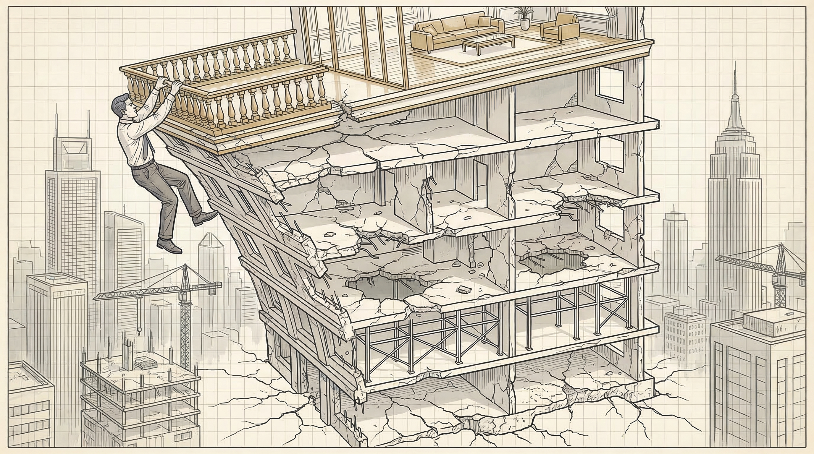
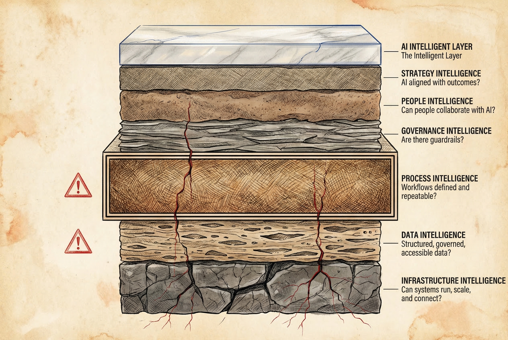
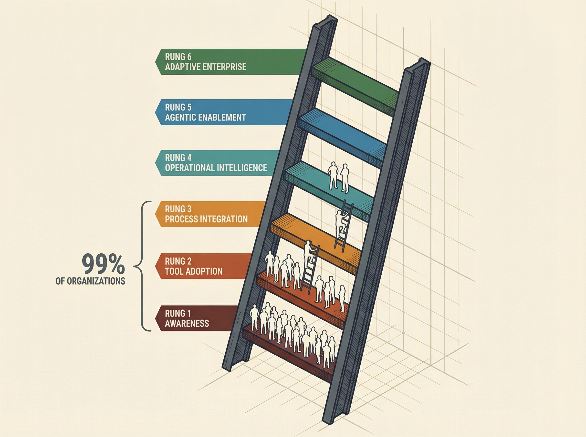

# Stop Building the Penthouse on a One-Story Foundation

*For leaders who watched an AI pilot quietly die*

**The Layers & Ladders framework reveals the six structural floors AI requires — and the six-rung maturity ladder that shows exactly where you are in the climb.**

---

## The Penthouse Everyone Wants

Everyone is building the penthouse.

AI copilots. Autonomous agents. Intelligent automation. The top floor is gorgeous. Every vendor has a brochure for it. Every board meeting asks about it.

But here is what nobody talks about at the conference keynote: 80% of AI projects fail. Not 20%. Not half. Eighty percent. That is twice the failure rate of regular technology projects.

And it is not the technology's fault.

When AI reaches production, it works 80% of the time. The models are good. The tools are capable. The technology does what it promises.

The problem is everything that happens before production. The foundation. The floors beneath the penthouse that nobody wants to build because they are not exciting, not vendor-funded, and not the thing that gets applause in a board meeting.

**This post is for a specific kind of leader.** The VP of Operations who pitched an AI pilot that quietly died. The Director who watched a promising tool go unused six weeks after launch. The COO who has been asked three times for an "AI strategy" and still does not have a good answer.

You already feel the pressure:

- Your team is drowning in manual work, but your headcount request was denied — again
- You tried an AI tool that was supposed to save hours, and nobody adopted it
- Your credibility is on the line because the last initiative did not deliver what you promised

Build the floors first. Here is what changes:

- You stop guessing which AI investment will work and start **diagnosing** which foundation is weak
- You delegate to AI agents with confidence because the handoff points are designed, not hoped for
- Your results compound instead of collapse — because each layer reinforces the next

You cannot apply an intelligent layer on top of an unintelligent foundation.

That is the core principle of this entire framework. And once you see it, you cannot unsee it.

---

## The Pattern That Keeps Repeating

The failure is not random. It follows a script.

A company gets excited about AI. Leadership attends a conference or reads a report. Budget appears. A pilot launches. The technology works in the demo. The team is optimistic.

Then it stalls.

Not with a dramatic failure. With a quiet fade. The pilot stays in "testing." Adoption drops. The data is messier than expected. Nobody owns the process the AI was supposed to improve. Six months later, the project is shelved and the conversation moves to the next shiny tool.

This is not a story about one company. This is the default pattern. McKinsey found that 74% of organizations struggle to scale AI — even though 88% are actively using it. The adoption rate doubled. The scaling success rate did not.

RAND Corporation studied this failure pattern and found that 84% of AI project failures are leadership-driven, not technology-driven. The breakdowns: 73% lack clear success metrics. 68% underinvest in data governance. 61% treat AI as an IT project instead of a business transformation.

Toyota provides the counter-example. When Toyota Motor North America deployed agentic AI for supply chain planning, they did not start with the AI. They started with process documentation. Toyota's production system had spent decades making every workflow explicit, every decision point defined, every handoff structured.

The result: forecast accuracy improved 20%. Planner productivity jumped 18%. They transitioned 40-50 planners from spreadsheet-heavy workflows to an agent-assisted model — and it worked because the Process Intelligence layer was already mature.

Toyota did not have a technology advantage. They had a foundation advantage.

That observation — repeated across dozens of successful and failed AI deployments — is what led to the framework you are about to learn.

The organizations that succeed at AI are not the ones with the best tools. They are the ones with the strongest floors beneath them.

---

## The Six Layers: What Must Exist Before AI Works

AI is not magic. It is a cognitive layer that sits on top of six structural foundations. Weakness in any one of them creates a ceiling on what AI can do.

Most organizations treat AI as a tool decision. It is a structural decision. It touches how data flows, how processes run, how people work, how risk is governed, and how strategy is defined.

Here are the six layers. Each one has a diagnostic question. If you cannot answer it confidently, that layer needs work before your next AI investment.

### Layer 1: Infrastructure Intelligence

**Diagnostic question:** *Can your systems reliably run, scale, and connect?*

Cloud architecture. APIs. Identity and access management. Compute capacity. This is the plumbing. If it leaks, nothing above it holds pressure.

Cisco's AI Readiness Index found that only 15% of organizations have networks fully ready for AI — versus 71% among the companies leading in AI adoption. Infrastructure readiness is the single strongest differentiator between AI leaders and everyone else.

This layer gets the most investment. It also exposes the trap: 86% of organizations say legacy tools that cannot support modern AI are a significant barrier. Throwing money at infrastructure without addressing the layers above it does not solve the problem.

### Layer 2: Data Intelligence

**Diagnostic question:** *Do you have structured, governed, accessible data?*

Clean data. Defined ownership. Metadata. Pipelines. Versioning.

AI does not create truth. It amplifies whatever exists. Feed it ambiguous data and you get confident-sounding ambiguity at scale.

Ninety-six percent of organizations encounter data quality problems when training AI models. Only 15% have mature data governance. Only 32% report high data readiness.

The payoff is real when you fix it. Organizations with mature data governance achieve 24% revenue improvement and 25% cost savings from AI. Those without governance get neither.

### Layer 3: Process Intelligence

**Diagnostic question:** *Are your workflows defined, measured, and repeatable?*

This is the layer where most AI initiatives quietly fail. And it is the layer that gets the least attention.

Documented processes. Clear inputs and outputs. Defined decision points. Feedback loops. Metrics.

You cannot automate ambiguity. If a process exists only in someone's head, an AI agent cannot execute it. If a workflow has no defined success criteria, there is no way to verify whether an agent performed it correctly.

Only 1% of firms have business processes sufficiently under control to realize the full financial benefits of digital transformation. One percent.

RPA taught this lesson first. When organizations applied automation to workflows they did not fully understand, 30-50% of those projects failed. The root cause was process ambiguity, not technology limitations. AI agents are making the same error at greater scale.

This is where a discipline called **Agentic Process Architecture** applies. It is built on two core capabilities:

**Flow Bridges.** A Flow Bridge is a structured transition point between human work and agent work — or between agents. In traditional process mapping, you model steps. In agentic process design, you model bridges. Because the risk is not in the step. The risk is in the transition.

A strong Flow Bridge is:

- **Clear** — inputs and outputs are explicitly defined artifacts
- **Verifiable** — validation logic matches the risk level
- **Recoverable** — there is a defined rollback, retry, or escalation path

Without Flow Bridges, agents overreach, humans over-review, bottlenecks multiply, and trust collapses. With them, autonomy increases safely and delegation compounds.

**Drift Signals.** A Drift Signal is an observable indicator that something has shifted in an agent's performance. The capability boundary moved. A failure pattern changed. A Flow Bridge needs redesign. Verification thresholds need recalibration.

Drift Signals include unexpected agent success, subtle output degradation, changes in escalation frequency, error clustering by task type, and increased human rework at specific bridges.

Every Drift Signal updates your failure model, your verification logic, and your autonomy level. This becomes your living operational intelligence loop.

**The Agent Enablement Ladder** lives inside this layer — a six-level maturity progression for how much autonomy your agents can safely handle:

- **Level 0 — Manual Execution.** Humans do everything. No standard artifacts.
- **Level 1 — Assisted Drafting.** Agents propose; humans structure and decide.
- **Level 2 — Flow-Bridged Workflow.** Defined bridges with verification at each transition.
- **Level 3 — Controlled Delegation.** Escalation logic, stop conditions, and risk-tiered verification.
- **Level 4 — Partial Autonomy.** Agents handle low-risk cases end-to-end. Humans handle exceptions.
- **Level 5 — Managed Autonomy.** Humans supervise through metrics, sampling, and Drift Signal monitoring.
- **Level 6 — Adaptive Autonomy.** Flow Bridges redesign continuously as Drift Signals emerge. The system improves itself.

The promotion rule is simple: autonomy increases only when verification evidence and controls mature. Not through optimism. Through evidence.

### Layer 4: Governance Intelligence

**Diagnostic question:** *Are there guardrails?*

Risk management. Policy alignment. Security review. Model validation. Auditability.

Shadow AI is already inside your company. Fifty percent of employees use unapproved tools regularly. Organizations average 269 shadow AI tools per 1,000 employees. Forty-seven percent of organizations using GenAI have already experienced problems — hallucinated outputs, data leakage, compliance incidents.

Only 28% have formally defined oversight roles for AI governance.

Most leaders get the paradox backwards: governance does not slow AI down. Organizations with mature AI governance keep projects operational for 3+ years at more than double the rate of low-maturity organizations (45% vs. 20%). Governance prevents the credibility-destroying failures that end AI programs entirely.

### Layer 5: People Intelligence

**Diagnostic question:** *Do your people know how to collaborate with AI?*

Prompt literacy. Critical evaluation of AI output. Role clarity in human-agent workflows. Change readiness. Leadership alignment.

AI transformation is behavioral before it is technical. The most sophisticated model in the world produces nothing if the people around it do not know how to direct it, verify it, or trust it appropriately.

Only 31% of organizations say their talent is ready to leverage AI. Fifty-two percent lack AI skills entirely. Fifty-seven percent of AI failures involve user adoption resistance.

Organizations that invest in cultural change see 5.3x higher transformation success rates than those focused only on technology.

### Layer 6: Strategy Intelligence

**Diagnostic question:** *Is AI aligned with business outcomes?*

Clear economic intent. Prioritized use cases. An investment thesis. Value measurement.

Leaders who focus on an average of 3.5 use cases anticipate 2.1x greater ROI than organizations spread across 6.1. The instinct to hedge bets through pilot volume is a failure pattern, not a hedge.

Only 17% of organizations using GenAI report a meaningful impact on EBIT — despite nearly 80% using it in at least one function. The tools are everywhere. The strategy is not.

---

## The Ladder: How High You Have Climbed

Layers describe structure — what must exist. The ladder describes maturity — how far along you are.

You do not jump to the top rung. You climb. And how fast you climb depends on the strength of your layers.

### Rung 1 — Awareness

Individuals are experimenting on their own. Shadow AI is present. There is no formal strategy, no shared vocabulary, no organizational intent. The foundation is unstable, but curiosity exists.

**What holds organizations here:** No Strategy Intelligence. No Governance Intelligence. Leadership has not signaled direction. Eight percent of organizations remain at this stage.

**Primary blocker:** Strategy Intelligence — until leadership defines direction, experimentation stays scattered and invisible.

### Rung 2 — Tool Adoption

AI tools have been introduced. Some productivity gains are visible at the individual level. But there is no systemic integration, no shared process, and no measurement.

**What holds organizations here:** Tools without process. Adoption without governance. Individual gains that do not compound because they are not embedded in workflows. Thirty-nine percent of organizations — the largest cluster — are stuck here.

**Primary blocker:** Process Intelligence — tools without workflows are isolated wins that never scale.

### Rung 3 — Process Integration

AI is embedded in defined workflows. KPIs are being tracked. Data pipelines are strengthened to support AI-driven processes. The foundational layers are becoming coherent and mutually reinforcing.

**What holds organizations here:** Process Intelligence gaps — undefined handoffs, unclear verification, inconsistent quality. This is where Agentic Process Architecture becomes critical.

**Primary blocker:** Process Intelligence (deep) — the handoffs, verification logic, and Flow Bridges that make delegation safe.

### Rung 4 — Operational Intelligence

Cross-functional data integration. Governance is formalized. There is a repeatable AI deployment model. The organization is building intelligence beneath the surface — not just using AI, but operating with it as a structural capability.

**What holds organizations here:** People Intelligence and Governance Intelligence gaps at scale. Scaling requires trust frameworks, role clarity, and institutional learning.

**Primary blocker:** People Intelligence — the organization knows what to do but the people system has not caught up.

### Rung 5 — Agentic Enablement

AI agents execute bounded decisions. Human oversight frameworks are in place. Economic impact is measured and attributed. The intelligent layer can now sit safely on top of the foundational layers because those layers have earned it.

**What holds organizations here:** Insufficient process discipline. Delegation without architecture. Autonomy without evidence. Only 11% of organizations have agentic AI in full production.

**Primary blocker:** Process Intelligence (agent-level) — the Flow Bridges and Drift Signals that make autonomous operation trustworthy.

### Rung 6 — Adaptive Enterprise

Continuous learning loops. Model improvement flywheels. AI is embedded in strategy itself — not as a tool the organization uses, but as a capability the organization develops. The organization becomes self-improving.

Only 1% of organizations describe their AI rollout as mature. This rung is not theoretical — it is the destination. But you cannot leap there. You climb.

### The Connection

A gap in any layer creates a ceiling on how high you can safely climb.

The diagnostic question is always two-part: Which layers are weak? What rung are you on? The prescription follows: strengthen the weakest layer that is blocking the next rung.

---

## Five Ways This Plays Out

### 1. Toyota: Process Intelligence as the Launching Pad

Toyota Motor North America did not start their agentic AI journey with AI. They started with decades of process documentation through the Toyota Production System.

When they deployed AI-assisted supply chain planning with AWS and Deloitte, they transitioned 40-50 planners from spreadsheet-heavy workflows to an agent-assisted model. Forecast accuracy improved by 20%. Planner productivity increased by 18%. They saved 10,000 hours annually.

The AI did not create the advantage. The Process Intelligence layer — decades in the making — did. Toyota had every Flow Bridge defined before the first agent touched a workflow.

### 2. The Distribution Company Stuck at Rung 2

A pattern that surfaces repeatedly in mid-market distribution: leadership buys AI-powered demand forecasting software. The tool is excellent. The vendor demo was compelling.

Six weeks later, adoption is at 15%. The planners still use spreadsheets. Why? Because the underlying demand planning process was never documented. Different planners use different data sources, different adjustment methods, different exception rules. The AI tool needs one consistent process. The company has twelve.

The tool was not the problem. Rung 2 was. Process Intelligence — the third layer — was missing entirely. The organization bought a penthouse feature for a ground-floor building.

### 3. What Building the Process Layer Actually Looks Like

Here is what happens when someone builds it correctly — and what happens before they do.

A multi-agent content workflow: research agents, writing agents, editing agents, image generation agents, publishing agents — all designed to run in sequence. The capability was there from day one. The agents could execute every task.

But the workflow did not work.

Every piece required manual rescue at every step. The research agent produced artifacts the writing agent could not use. The editing agent had no verification criteria — it did not know what "done" looked like. Nothing connected. The workflow was technically AI-assisted but practically human-executed, with extra steps and extra confusion layered on top.

The work that changed everything was not upgrading the agents. It was building the bridges.

Every handoff documented: what artifact does the research agent produce? What format does the writer need as input? What verification checks does the editor run? What triggers a revision versus a publish? What escalation path exists when an agent hits an ambiguous case?

After those bridges existed, the workflow ran with minimal oversight. Not because the agents got smarter. Because the process got intelligent.

That is the difference the Process Intelligence layer makes — and it does not show up in any vendor demo.

### 4. The VP Who Bought Copilot Licenses

A VP of Operations at a 200-person professional services firm bought 150 Microsoft Copilot licenses. The pitch was clear: AI-powered productivity for the entire team.

Three months later, fewer than 20 people used it regularly. The VP had spent $54,000 on licenses and had nothing to show the CFO.

The problem was not Copilot. The problem was that nobody had defined what "productivity" meant for each role. Which processes would Copilot improve? What were the inputs? What were the expected outputs? Who would verify quality?

Three layers were weak simultaneously. People Intelligence (training was missing). Process Intelligence (defined workflows did not exist). Strategy Intelligence (use cases were not tied to outcomes). The tool could not compensate for all three.

### 5. Agents Without Bridges: The Trust Collapse

Research from Kore.ai and Spaceo documents what happens when organizations deploy AI agents without structured handoffs. By late 2025, enterprises experimenting with autonomous agents discovered that independence came at a steep cost: unpredictability, inefficiency, and lack of governance.

Forty percent of agentic AI deployments will be canceled by 2027 due to rising costs, unclear value, or poor risk controls. The primary factor is process ambiguity — agents operating without Flow Bridges. Without defined transition points, agents overreach into tasks they should not handle. Humans respond by over-reviewing everything, creating bottlenecks worse than the manual process the agents were supposed to replace.

Trust collapses. The project is shelved. And the organization adds another scar to its AI track record.

This is not a technology failure. It is an architecture failure. The agents were capable. The bridges were not built.

---

## The Myth That Keeps Leaders Stuck

**The myth:** AI success is a technology selection problem. Pick the right model, the right vendor, the right use case — and results follow.

**Why leaders believe it:** Every vendor reinforces this story. The conferences are organized around tools. The case studies highlight technology. The buying process centers on feature comparisons and demos. The entire ecosystem is designed to make you believe the technology is the variable that matters.

**The hidden cost:** When you treat AI as a technology selection problem, every failure feels like you chose wrong. You switch vendors. You try a different use case. You launch another pilot. Each cycle costs $500,000 to $2 million and six months of credibility. After two or three cycles, the organization develops "AI scar tissue" — a learned resistance to any AI initiative, regardless of merit.

**The truth:** AI success is a structural readiness problem. The technology works 80% of the time when it reaches production. The challenge is everything before production — the organizational foundation that determines whether a pilot ever gets there.

Eighty-four percent of AI failures are leadership-driven: poor metrics, inadequate governance, treating AI as IT instead of transformation. The technology was not the variable. The foundation was.

**The real problem is not tool selection. It is layer selection.** Which foundation is weakest? Which rung are you actually on? What must be strengthened before the next investment makes sense?

**What becomes possible when you shift:** You stop cycling through vendors and start building floors. Each floor makes the next investment more effective. Results compound instead of reset. And your team stops dreading the next AI initiative because this time, the foundation holds.

---

## Your Four-Week Starting Plan

You do not need a six-month consulting engagement to begin. You need four weeks of honest work.

### Week 1: Run a Layer Diagnostic

Score each of the six layers on a simple 1-5 scale:

| Layer | 1 (Absent) | 3 (Partial) | 5 (Strong) |
|-------|-----------|-------------|------------|
| Infrastructure Intelligence | No cloud, no APIs, legacy everything | Some cloud, some APIs, integration gaps | Scalable, connected, observable |
| Data Intelligence | No ownership, no governance, data silos | Some pipelines, some governance, quality inconsistent | Governed, accessible, trusted |
| Process Intelligence | Workflows in people's heads | Some documentation, no measurement | Defined, measured, repeatable |
| Governance Intelligence | No policies, shadow AI everywhere | Some policies, inconsistent enforcement | Formal oversight, defined roles, audit-ready |
| People Intelligence | No training, high resistance | Some training, uneven adoption | Role-based literacy, change-ready culture |
| Strategy Intelligence | No AI strategy, scattered pilots | Some prioritization, unclear ROI | Focused use cases, measured outcomes |

Your weakest layer is your ceiling. Everything else is secondary until that layer improves.

### Week 2: Determine Your Current Rung

Use the six-rung descriptions from the ladder section. Be honest. Most organizations are at Rung 1 or Rung 2. That is not a failure — 99% of organizations are below Rung 4. Knowing where you are is the first step to climbing.

Ask yourself:
- Are people experimenting individually with no coordination? (Rung 1)
- Have we deployed tools but they are not embedded in workflows? (Rung 2)
- Is AI integrated into at least one defined, measured process? (Rung 3)
- Do we have cross-functional integration and formal governance? (Rung 4)
- Are agents executing bounded decisions with human oversight? (Rung 5)

The answer tells you your starting point.

### Week 3: Prescribe One Intervention

Do not try to fix everything. Pick the single weakest layer that is blocking the next rung. One layer. One intervention.

If Process Intelligence is weak (it usually is): document one critical workflow end-to-end. Define the inputs, outputs, decision points, and handoffs. Make it explicit enough that someone outside the team could follow it.

If Data Intelligence is weak: identify the one data source your team depends on most and audit its quality, ownership, and accessibility.

If Strategy Intelligence is weak: define three use cases, rank them by business impact and feasibility, and kill the rest.

One intervention. Not ten.

### Week 4: Define Your First Flow Bridge

Pick one human-to-agent handoff in your operation. It does not need to be complex. A report that could be drafted by AI. A data extraction that could be automated. A document review that could be assisted.

For that one handoff, define:
- **The input artifact** — what does the agent receive?
- **The output artifact** — what does the agent produce?
- **The verification method** — how does a human confirm quality?
- **The escalation path** — what happens when the agent is uncertain?

That is your first Flow Bridge. It is small. It is specific. And it is the foundation for everything that scales after it.

### Quick-Start Checklist

- [ ] Score all six layers (1-5) with your leadership team — not alone
- [ ] Identify your current rung — be honest, not aspirational
- [ ] Name the single weakest layer blocking the next rung
- [ ] Document one workflow end-to-end this week
- [ ] Define one Flow Bridge for one human-agent handoff
- [ ] Brief your executive sponsor on the diagnostic results

### Three Obstacles You Will Hit

**"We do not have budget for this."** The Layer Diagnostic costs nothing. It is an internal conversation with a scoring rubric. The first Flow Bridge costs nothing — it is documentation work. The first real budget request comes after you have diagnostic evidence, which means you are asking with data instead of opinions.

**"We do not have an executive sponsor."** The diagnostic itself is your pitch. Run it. Present the results. The weakest-layer finding is the kind of clarity executives respond to — it names a specific problem and a specific next step. That is what sponsorship needs.

**"We do not know where to start."** You start with the Layer Diagnostic. That is the entire point of a diagnostic framework — it tells you where to start so you do not have to guess. Week 1 answers the question.

### Realistic Expectations

After four weeks, you will not have an AI-transformed organization. You will have something more valuable: clarity. You will know which layers are strong, which are weak, which rung you are on, and what single intervention gives you the most leverage.

That clarity is worth more than any AI tool purchase. Because it prevents the $500,000 pilot that dies in six months. And it builds the foundation that makes the next investment stick.

---

## The Floor Beneath the Penthouse

The Layers & Ladders framework is one idea: AI works when the foundation supports it, and the foundation has six specific, diagnosable layers.

The people who win at AI are not the ones who deploy first. They are the ones who build first. They diagnose before they invest. They document before they automate. They design the handoffs before they delegate.

If this framework resonated, share it with the operations leader on your team who is carrying the AI mandate alone. They need a diagnostic, not another pitch.

The work is not to deploy AI. The work is to build the organizational intelligence required to use it.

---

*Word Count: ~4,200*
